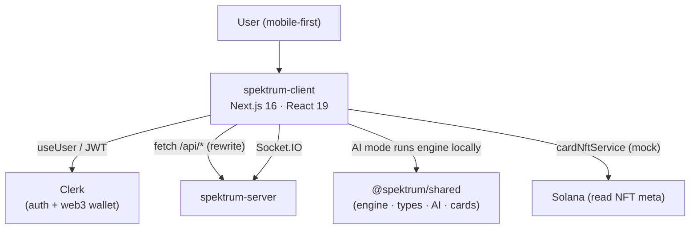
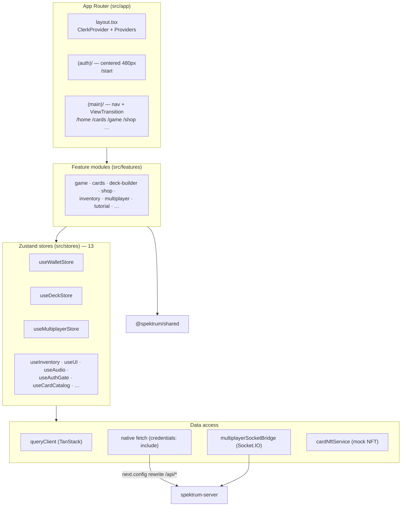
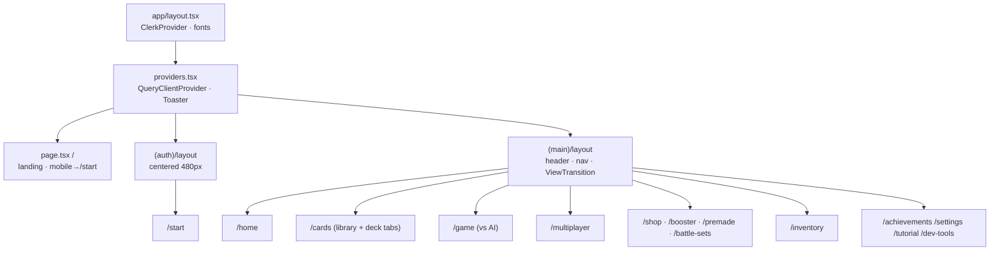
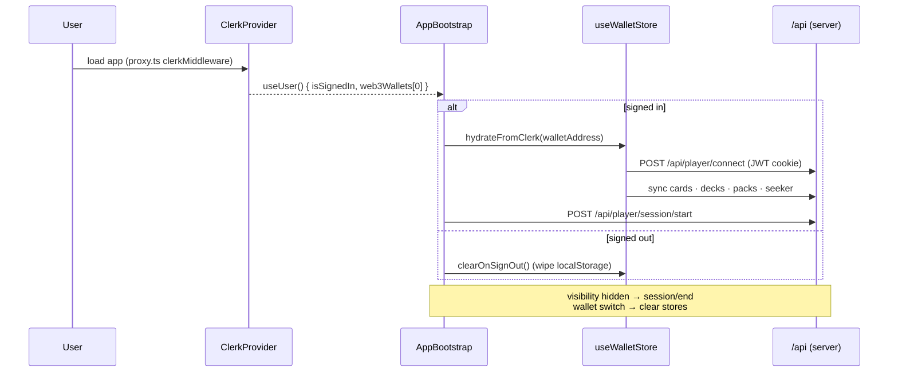
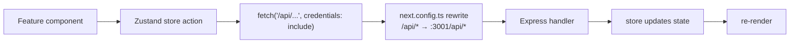
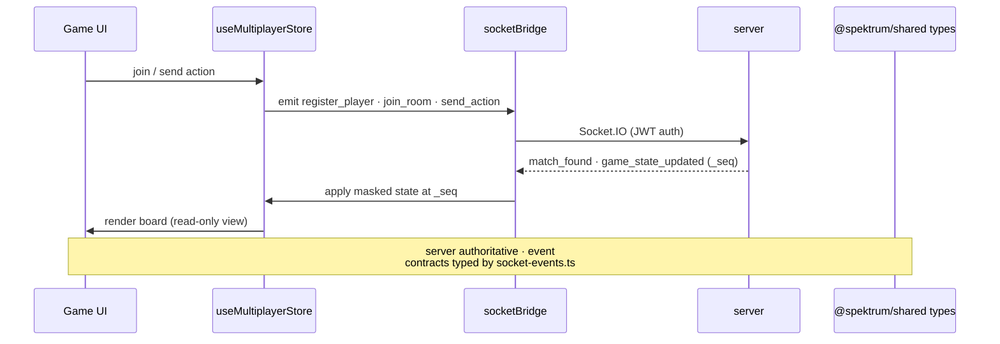
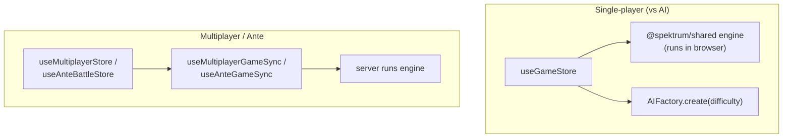
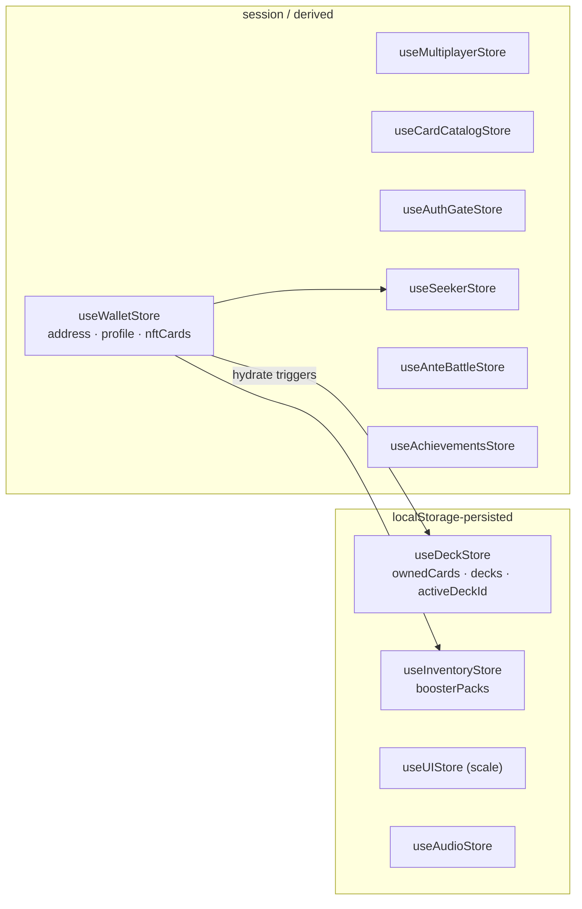
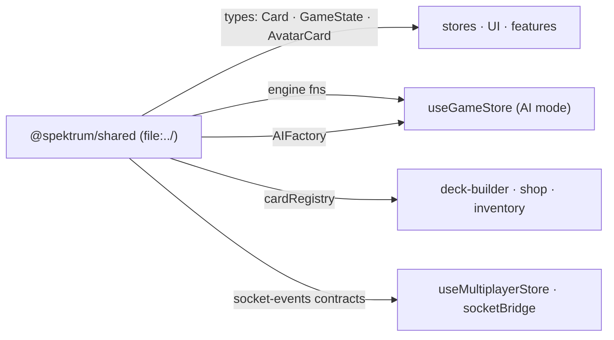

# Spektrum Client — Architecture

> Next.js 16 (App Router) · React 19 · Zustand · TanStack Query · Clerk · shadcn/Tailwind.
> Talks to `spektrum-server` via REST proxy + Socket.IO. Game rules from `@spektrum/shared`.

---

## 1. System Context

---

## 2. Layered Architecture

Pattern: **page → feature module → Zustand store → fetch/socket → server**. Stores own their own requests (no central API client).

---

## 3. Routing & Layouts

Rendering: root layout = RSC (metadata/fonts). All interactive pages = `"use client"` (Zustand). No ISR/streaming.

---

## 4. Auth & Bootstrap Flow

Auth gating is **modal-level** (`useAuthGateStore` → `AuthGateModal`), not middleware-blocked routes. JWT auto-sent via cookies (`credentials: 'include'`).

---

## 5. Data Flow — REST

Dev: Next :3000 + Express :3001 (rewrite bridges). Prod: unified server, same-origin.

---

## 6. Data Flow — Multiplayer (Socket.IO)

---

## 7. Game Modes

AI mode: client executes the **same shared engine** locally. Net mode: server executes it, client renders masked views. Identical rules either way.

---

## 8. State Stores

`useWalletStore.hydrateFromClerk` is the fan-out point: it syncs cards/decks/packs from the server and clears localStorage on wallet switch.

---

## 9. Shared Package Dependency

No build step — consumed as TS source, transpiled by Next. See `../spektrum-shared` for engine/type internals.

---

## 10. Key Files

| Concern | Path |
|---|---|
| Root layout + Clerk | `src/app/layout.tsx` |
| Providers (Query) | `src/app/providers.tsx` |
| Clerk middleware | `proxy.ts` |
| Auth/wallet bootstrap | `src/components/shared/AppBootstrap.tsx` |
| Wallet store | `src/stores/useWalletStore.ts` |
| Socket bridge | `src/services/multiplayerSocketBridge.ts` |
| API rewrite | `next.config.ts` |
| Game engine glue | `src/features/game/store.ts` |
| shadcn config | `components.json` |
